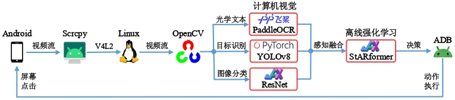
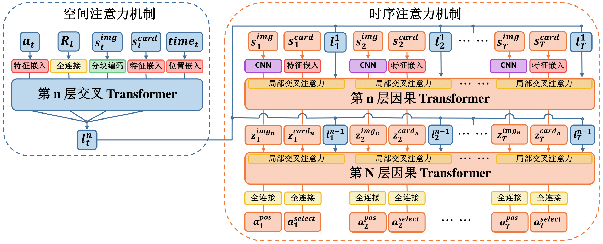
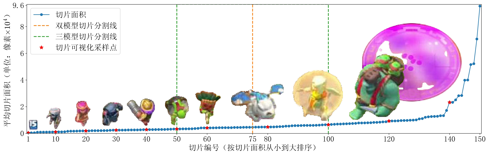

# 皇室战争非嵌入式AI

中文 | [English](README_en.md)

本仓库为我本科设计全部代码，目标是实现一个仅通过移动设备屏幕获取信息并做出决策的智能体，其设计框架如下


生成式目标识别数据集构建方法


制作的图像数据集：[GitHub - Clash-Royale-Detection-Dataset 目标识别、图像分类数据集](https://github.com/wty-yy/Clash-Royale-Detection-Dataset)。

YOLOv8目标检测
<div align="center">
  
  
</div>

决策模型架构设计


离线强化学习策略与8000分AI进行实时对局（[12个获胜对局-Bilibili](https://www.bilibili.com/video/BV1xn4y1R7GQ/?vd_source=92e1ce2ebcdd26a23668caedd3c9e57e)）
<div align="center">
  
  
  
</div>

## 环境要求
我使用的推理环境：手机系统为鸿蒙、电脑系统为 Ubuntu24.04 LTS，CPU: R9 7940H，GPU: RTX GeForce 4060 Laptop，平均决策用时 120ms，特征融合用时 240ms。

电脑至少需要一块Nvidia显卡，又由于手机视频流输入必须依赖Linux内核中的`V4L2`，且`JAX`的GPU版本不支持Windows，因此本项目的验证决策部分**只能Linux**系统下运行。

## 依赖包安装
在`requirements.txt`中列举了本项目所用到的Python包，但是由于使用了三种不同的神经网络框架，环境安装建议方法如下：

1. 安装[miniforge](https://github.com/conda-forge/miniforge)，创建环境`conda create -n katacr python==3.11`

2. 根据你的显卡驱动所支持的最高版本安装CUDA（使用`nvidia-smi`查看所支持的最高版本CUDA），建议直接在`conda`环境中安装`cuda`：
```shell
conda activate katacr
conda install -c conda-forge cudatoolkit=11.8 cudnn=8.9  # or cudatoolkit=12.0 cudnn=8.9
```

3. 安装神经网络框架：
  - [安装`JAX`](https://jax.readthedocs.io/en/latest/installation.html)（注意：CUDA11.8的编译版本请使用`pip install "jax[cuda11]==0.4.25 -f https://storage.googleapis.com/jax-releases/jax_cuda_releases.html"`，最新版已经不再支持CUDA11.8）
  - [安装`Pytorch 2.2.2`](https://pytorch.org/get-started/previous-versions/#v222)
  - [安装`PaddlePaddle 2.6.1`](https://www.paddlepaddle.org.cn/install/quick?docurl=/documentation/docs/zh/install/pip/linux-pip.html)

  - 执行`debug/cuda_avail.py`查看神经网络框架是否都已支持GPU

4. 安装其他依赖包：`pip install -r requirements.txt`

Scrcpy的安装方法见[scrcpy/doc/linux](https://github.com/Genymobile/scrcpy/blob/master/doc/linux.md)

## 模型验证
> 注意：由于我使用的手机屏幕分辨率为 `1080x2400` 高比宽为 `2.22`，其他屏幕位置的相对参数均在该分辨率比例下确定，如果需要使用不同的分辨率，请在 [`constant.py`](./katacr/build_dataset/constant.py) 中修改 `split_bbox_params` 中的 `part{idx}_{ratio}`，其中 `idx=1,2,3` 分别表示右上角时间图像位置，中间竞技场和下方手牌区域，可以使用 [`split_part.py`](./katacr/build_dataset/utils/split_part.py) 进行调试，`ratio` 为你的手机屏幕高比宽比例。
### 目标识别模型
这里给出最佳性能双目标组合识别器，将模型权重文件放到 `KataCR/runs` 下，修改代码 [`combo_detect.py`](./katacr/yolov8/combo_detect.py) 中的识别视频文件，即可在 `KataCR/logs/detection/{start-time}` 下看到目标识别出的结果。
| 模型名称 | 参数下载 | 更新时间 |
| - | - | - |
| YOLOv8 x2 | [detector1 v0.7.13](https://drive.google.com/file/d/1DMD-EYXa1qn8lN4JjPQ7UIuOMwaqS5w_/view?usp=drive_link), [detector2 v0.7.13](https://drive.google.com/file/d/1yEq-6liLhs_pUfipJM1E-tMj6l4FSbxD/view?usp=drive_link) | 2024.05.01. |

### 分类模型
这是两个用ResNet实现的模型
| 模型名称 | 参数下载 | 备注 |
| - | - | - |
| 卡牌分类器 | [CardClassification](https://drive.google.com/drive/folders/1Ely1gIOEOui7uHLppeS7tLXNtdkvit07?usp=drive_link) | 仅对2.6速猪卡牌进行分类 |
| 圣水分类器 | [ElixirClassification](https://drive.google.com/drive/folders/1cuqD_WQaa4uOlzSVEqLUwGmy0XNucteU?usp=drive_link) | 仅对圣水数字-1,-2,-3,-4进行分类 |

### 决策模型
三种不同决策模型的验证方法不同
| | 连续动作预测模型（有Delay） | 离散动作预测模型（无Delay） | 连续动作预测全卡牌模型 |
|-|-|-|-|
| 验证代码 | [eval.py](./katacr/policy/offline/eval.py) | [eval_no_delay.py](./katacr/policy/offline/eval_no_delay.py) | [eval_all_unit.py](./katacr/policy/offline/eval_all_unit.py) |
| 模型参数下载 | [StARformer_3L__step50](https://drive.google.com/drive/folders/1kqE_2xDainIixf4u5YD12aqT5_LxiZwZ?usp=drive_link)<br>[DT_4L__step50](https://drive.google.com/drive/folders/1gwkFdxYdjM7gdbiJkcPYRmt2lMXPqZWa?usp=drive_link) | [StARformer_no_delay_2L__step50](https://drive.google.com/drive/folders/1RuS9SgwVOI4C67NVW526F5I1H_KbPXOs?usp=drive_link) | [StARformer_3L_pred_cls__step50](https://drive.google.com/drive/folders/1STbGjjai4gTA8sEbbfZDqmE6M7xweqG_?usp=drive_link) |
| 总奖励（测试20回合） | −4.7±3.1 <br> −5.7±2.5 | −7.5±0.8 | −5.6±2.1

将模型权重文件放到`KataCR/logs/Policy/{model-name}`中，模型验证方法如下：
```shell
cd KataCR/katacr/policy/offline
python eval.py --load-epoch 3 --eval-num 20 --model-name "StARformer_3L_v0.8_golem_ai_cnn_blocks__nbc128__ep30__step50__0__20240512_181646"
python eval.py --load-epoch 8 --eval-num 20 --model-name "DT_4L_v0.8_golem_ai_cnn_blocks__nbc128__ep20__step50__0__20240519_224135"
python eval_no_delay.py --load-epoch 1 --eval-num 20 --model-name "StARformer_no_delay_2L_v0.8_golem_ai_cnn_blocks__nbc128__ep20__step50__0__20240520_205252"
python eval_all_unit.py --load-epoch 2 --eval-num 20 --model-name "StARformer_3L_pred_cls_v0.8_golem_ai_cnn_blocks__nbc128__ep20__step50__0__20240516_125201"
```
模型会自动点击屏幕中的几个位置进入训练师对局，当然这几个点位也是相对 `2.22` 分辨率高宽比设定的，自行对 [`sar_daemon.py`](./katacr/policy/env/sar_daemon.py) 中的 `def _start_new_episode(self)` 函数进行修改。

## 模型训练
### YOLOv8
YOLOv8模型的重构内容见[yolov8_modify](./asserts/yolov8_modify.md)。
- 生成式数据集下载[Clash-Royale-Detection-Dataset](https://github.com/wty-yy/Clash-Royale-Detection-Dataset)，修改[build_dataset/constant.py](./katacr/build_dataset/constant.py)中`path_dataset`参数为本机的数据集路径。
- 生成式目标识别图像：执行[build_dataset/generator.py](./katacr/build_dataset/generator.py)，即可在`KataCR/logs/generation`文件夹下看到生成的原图像与带目标识别的图像。
- YOLOv8训练：由于本任务识别类别数目多达150个，所以我尝试了YOLOv8检测器组合方法，每个识别器分别对不同切片大小的类别进行识别：

橙色和绿色虚线分别分割了双和三模型组合所需识别的切片类型，训练不同模型组合方法如下：
  1. 配置多模型参数配置文件[`yolov8/cfg.py`](./katacr/yolov8/cfg.py)
  2. 执行[`yolov8/model_setup.py`](./katacr/yolov8/model_setup.py)可自动在`./katacr/yolov8/detector{i}`下生成对应的识别器配置用于模型训练（所需识别的类别，验证集路径）
  3. 配置[`yolov8/ClashRoyale.yaml`](./katacr/yolov8/ClashRoyale.yaml)中`name`模型名称、`device`GPU设别编号和一些数据增强策略
  4. 训练：执行[`yolov8/train.py`](./katacr/yolov8/train.py)对模型进行训练（本项目的训练曲线图[wandb_YOLOv8](https://wandb.ai/wty-yy/YOLOv8)）
  5. 验证：执行[`yolov8/combo_validator.py`](./katacr/yolov8/combo_validator.py)对组合模型进行验证
  6. 推理：执行[`yolov8/combo_detect.py`](./katacr/yolov8/combo_detect.py)对组合模型进行推理（推理中可以制定目标追踪算法）
- 决策模型训练：
  1. 离线数据集制作（也可直接从[Clash Royale Replay Dataset](https://github.com/wty-yy/Clash-Royale-Replay-Dataset)下载）：
    1. 将原始对战视频通过[`build_dataset/cut_episodes.py`](./katacr/build_dataset/cut_episodes.py)通过OCR识别按照回合进行划分
    2. 使用[`build_dataset/extract_part.py`](./katacr/build_dataset/extract_part.py)将回合中的竞技场部分单独截取出来
    3. 使用[`policy/replay_data/offline_data_builder.py`](./katacr/policy/replay_data/offline_data_builder.py)进行特征融合制作出离线数据集，制作结果保存于`KataCR/logs/offline/{start-time}/`文件夹下

  2. 参考[train_policy.sh](./train_policy.sh)中代码
  ```shell
  CUDA_VISIBLE_DEVICES=$1 \  # 指定GPU编号（只支持单卡训练）
  python katacr/policy/offline/train.py --wandb \  # 启用wandb在线记录
    --total-epochs 20 --batch-size 32 --nominal-batch-size 128 \  # 训练参数配置
   --cnn-mode "cnn_blocks" --name "StARformer_3L_v0.8_golem_ai_interval2" --pred-card-idx --random-interval 2 --n-step 50 \  # 模型参数配置
    --replay-dataset "/data/user/zhihengwu/Coding/dataset/Clash-Royale-Replay-Dataset/golem_ai"  # 数据集参数配置
  ```
  （本项目的训练曲线图[wandb_ClashRoyale_Policy](https://wandb.ai/wty-yy/ClashRoyale%20Policy)）

## 代码架构

- `build_dataset/`：
  - 对视频文件进行预处理（划分episode，逐帧提取，图像不同部分提取）
  - 目标识别数据集搭建工具（辅助标记数据集，数据集版本管理，生成式目标识别，标签转化及识别标签生成，图像切片提取）
- `classification/`：用ResNet进行手牌及圣水分类
- `constants`：常量存储（卡牌名称及对应圣水花费，目标识别类别名称）
- `detection`：自行用JAX复现的YOLOv5模型（后弃用）
- `interact`：测试与手机进行实时交互，包括目标识别，文本识别，GUI
- `ocr_text`：包括用JAX复现的CRNN（后弃用）和PaddleOCR的接口转化
- `policy`：
  - `env`：两种测试环境：
    - `VideoEnv`：将视频数据集作为输入，仅用于调试模型的输入是否与预测相对应
    - `InteractEnv`：与手机进行实时交互，使用多进程方式执行感知融合
  - `offline`：包含了决策模型`StARformer`和`DT`的训练，验证的功能，并包含三种CNN测试结构`ResNet,CSPDarkNet, CNNBlocks`
  - `perceptron`：感知融合：包含了`state,action,reward`三种特征生成器，并整合到`SARBuilder`中（感知基于`YOLOv8,PaddleOCR,ResNet Classifier`）
  - `replay_data`：提取专家视频中的感知特征，制作并测试离线数据集
  - `visualization`：实时监测手机图像，可视化感知融合特征
- `utils`：用于目标检测相关的工具（绘图、坐标转化、图像数据增强），用于视频处理的`ffmpeg`相关工具
- `yolov8`：重构YOLOv8源码，包括数据读取、模型训练、验证、目标检测、跟踪，模型识别类型设置以及参数配置
