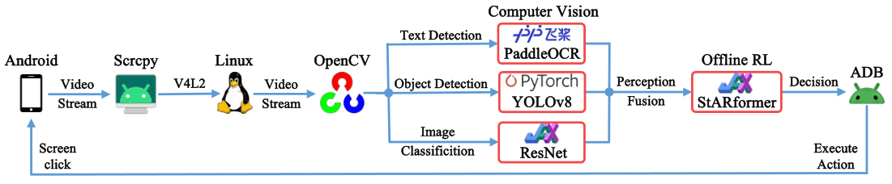
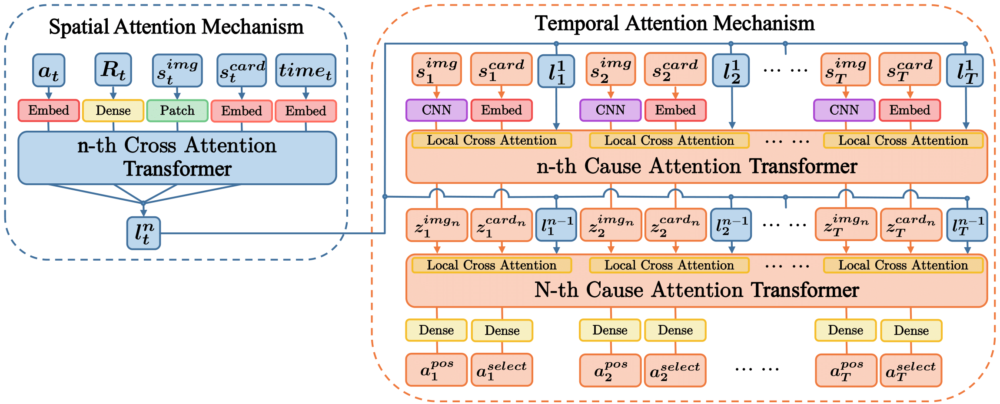
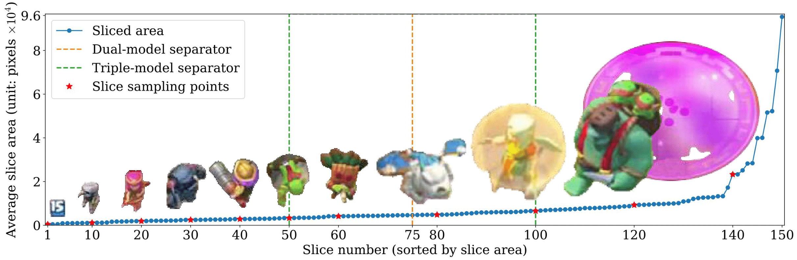

# Non-Embedded AI for Clash Royale

Chinese | [English](README_en.md)

This repository contains all the code for my undergraduate thesis project, which aims to create an intelligent agent that makes decisions solely based on information from a mobile device screen. The design framework is as follows:


Method for generating a target detection dataset:


Created image dataset: [GitHub - Clash-Royale-Detection-Dataset Target Detection and Image Classification Dataset](https://github.com/wty-yy/Clash-Royale-Detection-Dataset).

YOLOv8 Object Detection
<div align="center">
  
  
</div>

Design of the Policy Model Architecture


Offline Reinforcement Learning Strategy for Real-time Matches with 8000-Point AI ([12 Consecutive Wins on Bilibili](https://www.bilibili.com/video/BV1xn4y1R7GQ/?vd_source=92e1ce2ebcdd26a23668caedd3c9e57e))
<div align="center">
  
  
  
</div>

## Environment Requirements
Inference environment used: Mobile system HarmonyOS, Computer system Ubuntu 24.04 LTS, CPU: R9 7940H, GPU: RTX GeForce 4060 Laptop, with an average decision-making time of 120ms and feature fusion time of 240ms.

A computer with an Nvidia graphics card is required, and since the mobile video stream input must rely on `V4L2` in the Linux kernel and the GPU version of `JAX` does not support Windows, the decision verification part of this project **can only run on Linux**.

## Installation of Dependencies
The Python packages used in this project are listed in `requirements.txt`, but since three different neural network frameworks are used, the suggested installation method is as follows:

1. Install [miniforge](https://github.com/conda-forge/miniforge) and create an environment `conda create -n katacr python==3.11`

2. Install CUDA based on the highest version supported by your graphics card driver (check the supported version with `nvidia-smi`). It is recommended to install `cuda` directly in the `conda` environment:
```shell
conda activate katacr
conda install -c conda-forge cudatoolkit=11.8 cudnn=8.9  # or cudatoolkit=12.0 cudnn=8.9
```

3. Install the neural network frameworks:
  - [Install `JAX`](https://jax.readthedocs.io/en/latest/installation.html) (Note: For CUDA 11.8, use `pip install "jax[cuda11]==0.4.25 -f https://storage.googleapis.com/jax-releases/jax_cuda_releases.html"`, the latest version no longer supports CUDA 11.8)
  - [Install `Pytorch 2.2.2`](https://pytorch.org/get-started/previous-versions/#v222)
  - [Install `PaddlePaddle 2.6.1`](https://www.paddlepaddle.org.cn/install/quick?docurl=/documentation/docs/zh/install/pip/linux-pip.html)

  - Run `debug/cuda_avail.py` to check if the neural network frameworks all support the GPU

4. Install other dependencies: `pip install -r requirements.txt`

For the installation method of Scrcpy, see [scrcpy/doc/linux](https://github.com/Genymobile/scrcpy/blob/master/doc/linux.md)

## Model Verification
> Note: Since my mobile screen resolution is `1080x2400` with an aspect ratio of `2.22`, the relative parameters of other screen positions are determined under this resolution ratio. If you need to use a different resolution, please modify the `part{idx}_{ratio}` in `split_bbox_params` in [`constant.py`](./katacr/build_dataset/constant.py), where `idx=1,2,3` represents the top-right corner time image position, the middle arena, and the bottom hand card area, respectively. Use [`split_part.py`](./katacr/build_dataset/utils/split_part.py) for debugging, and `ratio` is the aspect ratio of your mobile screen.

### Object Detection Model
Here is the best performance dual-object combination detector. Place the model weight files in `KataCR/runs` and modify the detection video file in [`combo_detect.py`](./katacr/yolov8/combo_detect.py) to see the detection results in `KataCR/logs/detection/{start-time}`.
| Model Name | Parameter Download | Update Time |
| - | - | - |
| YOLOv8 x2 | [detector1 v0.7.13](https://drive.google.com/file/d/1DMD-EYXa1qn8lN4JjPQ7UIuOMwaqS5w_/view?usp=drive_link), [detector2 v0.7.13](https://drive.google.com/file/d/1yEq-6liLhs_pUfipJM1E-tMj6l4FSbxD/view?usp=drive_link) | 2024.05.01. |

### Classification Model
These are two models implemented with ResNet
| Model Name | Parameter Download | Remarks |
| - | - | - |
| Card Classifier | [CardClassification](https://drive.google.com/drive/folders/1Ely1gIOEOui7uHLppeS7tLXNtdkvit07?usp=drive_link) | Classifies only 2.6 Cycle Hog Rider cards |
| Elixir Classifier | [ElixirClassification](https://drive.google.com/drive/folders/1cuqD_WQaa4uOlzSVEqLUwGmy0XNucteU?usp=drive_link) | Classifies only elixir numbers -1, -2, -3, -4 |

### Policy Model
The verification methods for three different policy models are different
| | Continuous Action Prediction Model (With Delay) | Discrete Action Prediction Model (No Delay) | Continuous Action Prediction Full Card Model |
|-|-|-|-|
| Verification Code | [eval.py](./katacr/policy/offline/eval.py) | [eval_no_delay.py](./katacr/policy/offline/eval_no_delay.py) | [eval_all_unit.py](./katacr/policy/offline/eval_all_unit.py) |
| Model Parameter Download | [StARformer_3L__step50](https://drive.google.com/drive/folders/1kqE_2xDainIixf4u5YD12aqT5_LxiZwZ?usp=drive_link)<br>[DT_4L__step50](https://drive.google.com/drive/folders/1gwkFdxYdjM7gdbiJkcPYRmt2lMXPqZWa?usp=drive_link) | [StARformer_no_delay_2L__step50](https://drive.google.com/drive/folders/1RuS9SgwVOI4C67NVW526F5I1H_KbPXOs?usp=drive_link) | [StARformer_3L_pred_cls__step50](https://drive.google.com/drive/folders/1STbGjjai4gTA8sEbbfZDqmE6M7xweqG_?usp=drive_link) |
| Total Reward (Test 20 Rounds) | −4.7±3.1 <br> −5.7±2.5 | −7.5±0.8 | −5.6±2.1

Place the model weight files in `KataCR/logs/Policy/{model-name}`, and verify the models as follows:
```shell
cd KataCR/katacr/policy/offline
python eval.py --load-epoch 3 --eval-num 20 --model-name "StARformer_3L_v0.8_golem_ai_cnn_blocks__nbc128__ep30__step50__0__20240512_181646"
python eval.py --load-epoch 8 --eval-num 20 --model-name "DT_4L_v0.8_golem_ai_cnn_blocks__nbc128__ep20__step50__0__20240519_224135"
python eval_no_delay.py --load-epoch 1 --eval-num 20 --model-name "StARformer_no_delay_2L_v0.8_golem_ai_cnn_blocks__nbc128__ep20__step50__0__20240520_205252"
python eval_all_unit.py --load-epoch 2 --eval-num 20 --model-name "StARformer_3L_pred_cls_v0.8_golem_ai_cnn_blocks__nbc128__ep20__step50__0__20240516_125201"
```
The model will automatically click on several positions on the screen to enter trainer matches. These positions are also set relative to the `2.22` resolution aspect ratio. Modify the `def _start_new_episode(self)` function in [`sar_daemon.py`](./katacr/policy/env/sar_daemon.py) accordingly.

## Model Training
### YOLOv8
For the reconstruction of the YOLOv8 model, see [yolov8_modify](./asserts/yolov8_modify.md).
- Download the generative dataset [Clash-Royale-Detection-Dataset](https://github.com/wty-yy/Clash-Royale-Detection-Dataset), and modify the `path_dataset` parameter in [build_dataset/constant.py](./katacr/build_dataset/constant.py) to your local dataset path.
- Generate target recognition images: Execute [build_dataset/generator.py](./katacr/build_dataset/generator.py), and you will see the original images and target recognition images in the `KataCR/logs/generation` folder.
- YOLOv8 Training: Due to the high number of recognition categories (150), a combination method of YOLOv8 detectors was used, where each detector recognizes different segment sizes:
  
  The orange and green dashed lines respectively separate the segment types required for recognition by dual and triple model combinations. Train different model combinations as follows:
  1. Configure the multi-model parameter configuration file [`yolov8/cfg.py`](./katacr/yolov8/cfg.py).
  2. Execute [`yolov8/model_setup.py`](./katacr/yolov8/model_setup.py) to automatically generate the corresponding detector configurations under `./katacr/yolov8/detector{i}` for model training (required recognition categories, validation set path).
  3. Configure the `name` (model name), `device` (GPU identifier), and some data augmentation strategies in [`yolov8/ClashRoyale.yaml`](./katacr/yolov8/ClashRoyale.yaml).
  4. Train: Execute [`yolov8/train.py`](./katacr/yolov8/train.py) to train the model (see the training curves [wandb_YOLOv8](https://wandb.ai/wty-yy/YOLOv8)).
  5. Validate: Execute [`yolov8/combo_validator.py`](./katacr/yolov8/combo_validator.py) to validate the combination models.
  6. Inference: Execute [`yolov8/combo_detect.py`](./katacr/yolov8/combo_detect.py) for inference using the combination models (you can specify the target tracking algorithm during inference).
- Decision Model Training:
  1. Offline dataset creation (you can also download it from [Clash Royale Replay Dataset](https://github.com/wty-yy/Clash-Royale-Replay-Dataset)):
    1. Divide the original battle videos into episodes using OCR recognition with [`build_dataset/cut_episodes.py`](./katacr/build_dataset/cut_episodes.py).
    2. Extract the arena part of the episodes separately using [`build_dataset/extract_part.py`](./katacr/build_dataset/extract_part.py).
    3. Perform feature fusion to create the offline dataset using [`policy/replay_data/offline_data_builder.py`](./katacr/policy/replay_data/offline_data_builder.py), saving the results in the `KataCR/logs/offline/{start-time}/` folder.

  2. Refer to the code in [train_policy.sh](./train_policy.sh):
  ```shell
  CUDA_VISIBLE_DEVICES=$1 \  # Specify GPU number (only single GPU training is supported)
  python katacr/policy/offline/train.py --wandb \  # Enable online recording with wandb
    --total-epochs 20 --batch-size 32 --nominal-batch-size 128 \  # Training parameter configuration
    --cnn-mode "cnn_blocks" --name "StARformer_3L_v0.8_golem_ai_interval2" --pred-card-idx --random-interval 2 --n-step 50 \  # Model parameter configuration
    --replay-dataset "/data/user/zhihengwu/Coding/dataset/Clash-Royale-Replay-Dataset/golem_ai"  # Dataset parameter configuration
  ```
  (See the training curves [wandb_ClashRoyale_Policy](https://wandb.ai/wty-yy/ClashRoyale%20Policy)).

## Code Architecture

- `build_dataset/`:
  - Preprocessing video files (dividing into episodes, extracting frames, extracting different parts of images).
  - Tools for building the target recognition dataset (assisting in data annotation, dataset version management, generative target recognition, label conversion, and recognition label generation, image segmentation extraction).
- `classification/`: Card and elixir classification using ResNet.
- `constants`: Storage of constants (card names and corresponding elixir costs, target recognition category names).
- `detection`: A self-implemented YOLOv5 model using JAX (later abandoned).
- `interact`: Testing real-time interaction with the mobile phone, including target recognition, text recognition, and GUI.
- `ocr_text`: Includes a self-implemented CRNN using JAX (later abandoned) and PaddleOCR interface conversion.
- `policy`:
  - `env`: Two testing environments:
    - `VideoEnv`: Uses video dataset as input, mainly for debugging whether the model input corresponds to the prediction.
    - `InteractEnv`: Real-time interaction with the mobile phone, using multi-process execution for perception fusion.
  - `offline`: Contains the training and validation functionalities of decision models `StARformer` and `DT`, and includes three CNN testing structures: `ResNet, CSPDarkNet, CNNBlocks`.
  - `perceptron`: Perception fusion: Includes `state, action, reward` feature generators and integrates them into `SARBuilder` (perception based on `YOLOv8, PaddleOCR, ResNet Classifier`).
  - `replay_data`: Extracts perceptual features from expert videos and creates and tests the offline dataset.
  - `visualization`: Real-time monitoring of mobile phone images and visualization of perceptual fusion features.
- `utils`: Tools related to object detection (drawing, coordinate conversion, image data augmentation), and `ffmpeg` related tools for video processing.
- `yolov8`: Reconstructed YOLOv8 source code, including data reading, model training, validation, object detection, tracking, model recognition type settings, and parameter configuration.